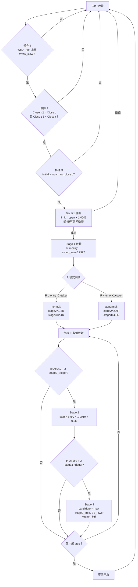

# 多頭趨勢策略 v2.2

> **商品**：加密貨幣（交易對可設定，預設 ETHUSDT）
> **週期**：可設定（`configs/default.yaml` 預設 15m）
> **方向**：做多（Long）
> **最後更新**：2026-05-05（v2.2 — entry_source 文件化、Stage 2 公式釐清滑點不重複計）
>
> 本文件**與程式碼一比一對齊**：
> - 進場：`src/strategy/long_strategy.py`
> - 三階段止損：`src/strategy/trailing.py`
> - 撮合 / Stage 1 安全檢查：`src/backtest/engine.py` + `src/broker/simulator.py`
> - 預設參數：`configs/default.yaml`

---

## 一、指標定義

| 指標 | 說明 | 用途 |
|------|------|------|
| **HA_Open / HA_High / HA_Low / HA_Close** | Heikin-Ashi 平均 K 線（HA_Close = (O+H+L+C)/4；HA_Open = (前一根 HA_Open + HA_Close) / 2） | `entry_source="ha"` 進場 |
| **WMA_fast / WMA_slow** | 原始 close 的加權移動平均，預設週期 = 2 / 4 | `entry_source="raw"` 進場 |
| **HA_WMA_fast / HA_WMA_slow** | HA_Close 的加權移動平均，預設週期 = 2 / 4 | `entry_source="ha"` 進場 |
| **swing low** | 原始 K 線「含當下、回看 N 根」最低價（N = `swing_lookback`，預設 4） | Stage 1 初始止損 |
| **Bollinger Band**（**原始** close） | 中軌 = WMA(close, 20)；上下軌 = 中軌 ± 2σ（σ 以中軌為基準） | Stage 3 拖曳止損 |

**注意**：
- ATR 不再用於止損（v2.0 Chandelier 已淘汰）。
- 止損相關計算（swing、Bollinger）**永遠**用原始 K 線，不受 `entry_source` 影響。

### 進場 K 線來源（`entry_source`）

策略支援兩種進場訊號來源，由 config `strategy.entry_source` 切換：

| `entry_source` | WMA 來源 | close 過濾來源 |
|----------------|---------|---------------|
| `"ha"`（HA 平滑訊號） | `ha_wma_fast` / `ha_wma_slow` | `ha_close` |
| `"raw"`（原始 K 線訊號，**default.yaml 目前預設**） | `wma_fast` / `wma_slow` | `close` |

下文「條件 1 / 條件 2」中的 `WMA_fast` / `WMA_slow` / `Close` 表示**對應來源**之欄位。

---

## 二、建倉條件（Entry）

在 **Bar[t]**（=「訊號 bar」/ Bar[0]）收盤後判斷以下兩條件，皆成立則於 **Bar[t+1]**（Bar[1]）開盤掛限價多單。

### 條件 1 — 趨勢過濾（黃金交叉）

- `WMA_fast[t]   >  WMA_slow[t]`
- `WMA_fast[t-1] <= WMA_slow[t-1]`

即 fast 由下往上穿越 slow，**當根**形成黃金交叉。

### 條件 2 — 趨勢結構確認

- `Close[t-2] < Close[t]`
- `Close[t-3] < Close[t]`

即交叉前第 2、第 3 根之 close 皆低於交叉當根，確認交叉前已是上升結構。

### 條件 3 — Stage 1 安全檢查（策略層）

策略產生訊號前，先用訊號 bar 的**原始** close 做防呆：

```
if initial_stop >= raw_close[t]:
    放棄訊號（不發出 EntrySignal）
```

避免極端窄幅 K 線下 swing low 被往下推到比當下價還高，導致一進場立刻被掃。

### 進場動作（Bar[t+1] 開盤）

- 限價單買入：`limit_price = Bar[t+1].open × (1 + slippage_pct)`（預設 0.03%；偏向上方確保 marketable）
- 撮合條件：`limit_price ≥ Bar[t+1].low` → 視為成交，`fill_price = min(limit_price, Bar[t+1].high)`
- **Broker 二次安全檢查**：成交後若 `initial_stop ≥ fill_price`（極端情況），broker 直接拒絕該筆訂單
- **倉位過槓桿檢查**：見「§五 倉位計算」；若計算出的 `notional > equity` 直接放棄
- 未在當根成交者廢單，不延期

```
時間軸示意：

... | Bar[t-3] | Bar[t-2] | Bar[t-1] | Bar[t] (=Bar[0]) 金叉發生 | Bar[t+1] (=Bar[1]) 進場 |
       ↑           ↑                          ↑                          ↑
   Close[t-3]  Close[t-2]              條件1+2 收盤判斷           limit = open × 1.0003
   需 < Close[t]  需 < Close[t]
```

---

## 三、三階段止損策略（Stop Loss）

止損採**狀態機式三階段**，所有階段共通：**ratchet（多單只能上移）**。
Engine 在每根 K 線：先用本根做盤中 stop 撞擊判定，再於收盤時呼叫 controller 更新 stop。

### Stage 1 — 初始保護

進場時由策略計算（記在 EntrySignal 上）：

```
swing_low    = min(low) over [t - swing_lookback + 1 .. t]   # 含訊號 bar
initial_stop = swing_low × (1 − stage1_slippage_buffer)
R            = entry_price − initial_stop                    # > 0
```

- 用 swing low 提供寬鬆初始保護；0.03% buffer 推離極值
- Stage 1 階段內 stop 不更新（controller 在 Stage 1 回 `None`）

### Stage 2 — 鎖利保本

**進度衡量**（`R = |entry − initial_stop|`）：

```
progress_r = (bar.high − entry_price) / R
```

**正常 / 異常 R 模式判定**：

| 模式 | 條件 | Stage 2 觸發 | Stage 3 觸發 |
|------|------|-------------|-------------|
| Normal | `R ≥ entry_price × 2 × taker_fee_rate`（雙向手續費距離） | **1.2 R** | **2.4 R** |
| Abnormal | `R < entry_price × 2 × taker_fee_rate` | **2.4 R** | **4.8 R** |

> ⚠️ 注意：成本距離只計**雙向 taker fee**，不含 slippage；
> 因為 slippage 已經內含於 `entry_price = open × (1 + slippage_pct)`，
> 若再加會重複計算（程式碼 `trailing.py:_stage2_breakeven_stop` 註解詳）。

**Stage 2 新止損公式**（觸發後固定值）：

```
stage2_stop = entry_price × (1 + 2 × taker_fee_rate) + stage2_buffer_r × R
```

即「進場價 + 補回雙向 taker fee + 0.2R 額外 buffer」。
0.2R buffer 避免價格小幅回拉就立即保本平倉，吃不到趨勢延續。

### Stage 3 — 趨勢跟蹤（Bollinger）

觸發後，每根 K 線收盤計算止損候選：

```
candidate = max(stage2_stop,  bb_lower[bar_index])
            其中 bb_lower = WMA(原始 close, 20) − 2σ
```

- Stage 2 fixed 永遠當作 floor：BB 暫時低於保本價時，stop 不下退
- BB 隨價格抬升 → candidate 自然上移 → ratchet 接管
- 若 `bb_lower` 為 NaN（暖機期）→ 退回 stage2_stop

### Ratchet 規則（所有階段共通）

```python
if candidate > current_stop:    # 多單只往上動
    update_stop(candidate)
# else: 維持原值，不退讓
```

- 階段推進是單向：1 → 2 → 3，不會回退
- stop 也是單向：永遠取較有利者

---

## 四、止盈策略（Take Profit）

無固定止盈點，全部由三階段 stop 帶出：

- Stage 1 被掃 → 接近 −R 的小虧
- Stage 2 被掃 → 接近保本（已含雙向手續費 + 0.2R buffer 的小盈）
- Stage 3 被掃 → 鎖到一定獲利後出場

由 Bollinger 下軌決定何時停利、讓利潤奔跑。

---

## 五、倉位計算（Position Sizing）

由 `account.sizing_mode` 切換（程式碼：`src/backtest/engine.py:_compute_quantity`）：

### `sizing_mode = "pct"`（預設）

```
notional = equity × position_size_pct      # 預設 60%
quantity = notional / limit_price
```

### `sizing_mode = "risk"`（固定金額風險）

每筆單在被 Stage 1 stop 掃時的虧損固定為 `risk_per_trade_usdt`：

```
unit_risk = |limit_price − initial_stop| + (limit_price + initial_stop) × taker_fee_rate
            ↑ 純價差            ↑ 雙向手續費價值補回
quantity  = risk_per_trade_usdt / unit_risk
notional  = quantity × limit_price
```

- 滑點已內含於 `limit_price`，不重複計
- 若 `notional > equity` → 視為過槓桿，**放棄此訂單**

成交後若 fill_price 與 limit_price 不同，broker 會用 fill_price 重算 quantity，維持「真實風險 ≈ target_risk」。

---

## 六、Config 參數

對應 `configs/default.yaml`。

### `strategy`

| 參數 | 說明 | 預設 |
|------|------|------|
| `wma_fast` | 快線週期 | 2 |
| `wma_slow` | 慢線週期 | 4 |
| `entry_source` | 進場 K 線來源（`ha` / `raw`） | `raw` |

### `strategy.trailing`

| 參數 | 說明 | 預設 |
|------|------|------|
| `swing_lookback` | Stage 1 swing 回看根數（含當下） | 4 |
| `stage1_slippage_buffer` | swing 點外推比例 | 0.0003 |
| `stage2_normal_trigger_r` | Normal R 之 Stage 2 觸發倍數 | 1.2 |
| `stage2_abnormal_trigger_r` | Abnormal R 之 Stage 2 觸發倍數 | 2.4 |
| `stage2_buffer_r` | Stage 2 保本 stop 額外 buffer | 0.2 |
| `stage3_normal_trigger_r` | Normal R 之 Stage 3 觸發倍數 | 2.4 |
| `stage3_abnormal_trigger_r` | Abnormal R 之 Stage 3 觸發倍數 | 4.8 |
| `bollinger_period` | BB 中軌 WMA 週期 | 20 |
| `bollinger_num_std` | BB 上下軌標準差倍數 | 2.0 |

### `account`

| 參數 | 說明 | 預設 |
|------|------|------|
| `initial_capital` | 多空各自帳戶初始資金 | 500 USDT |
| `sizing_mode` | 倉位模式（`pct` / `risk`） | `pct` |
| `position_size_pct` | `pct` 模式下每筆 notional 比例 | 0.60 |
| `risk_per_trade_usdt` | `risk` 模式下每筆 stop-out 固定虧損 | 1.0 |

### `fees`

| 參數 | 說明 | 預設 |
|------|------|------|
| `taker_fee_rate` | 限價即時撮合費率（VIP 0） | 0.0005 |
| `maker_fee_rate` | maker 費率（目前未使用，預留） | 0.0002 |
| `slippage_pct` | 限價單滑點 | 0.0003 |

---

## 七、邏輯流程圖



---

## 八、與舊版差異

| 項目 | v2.0（已棄用） | v2.1 | v2.2（本版） |
|------|---------------|------|--------------|
| 止損型態 | 單一 Chandelier | 三階段狀態機 | 三階段狀態機（同 v2.1） |
| Stage 2 公式 | — | `entry × (1 + 2×taker + slippage) + 0.2R` | `entry × (1 + 2×taker) + 0.2R`（**修正：滑點不重複計**） |
| Abnormal R 條件 | — | `R ≥ 2×taker + slippage` | `R ≥ entry × 2×taker`（**同上修正**） |
| `entry_source` | 隱含 HA | 隱含 HA | 文件化 `ha` / `raw` 切換 |
| Config 文件 | atr_*** | trailing.*** | 補上 `account` / `fees` 區塊 |

---

*本文件作為策略行為的權威描述，與 `src/strategy/` 程式碼一比一對齊。*
*若兩者出現分歧，**以程式碼為準**並回頭修本文件。*
